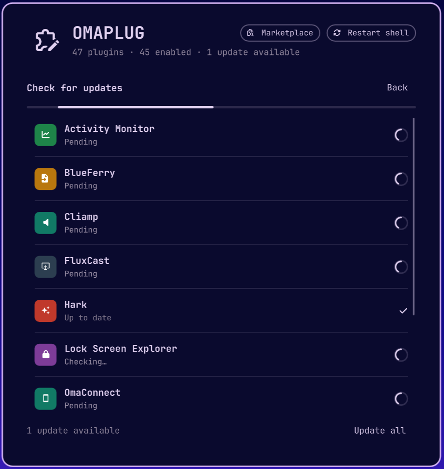
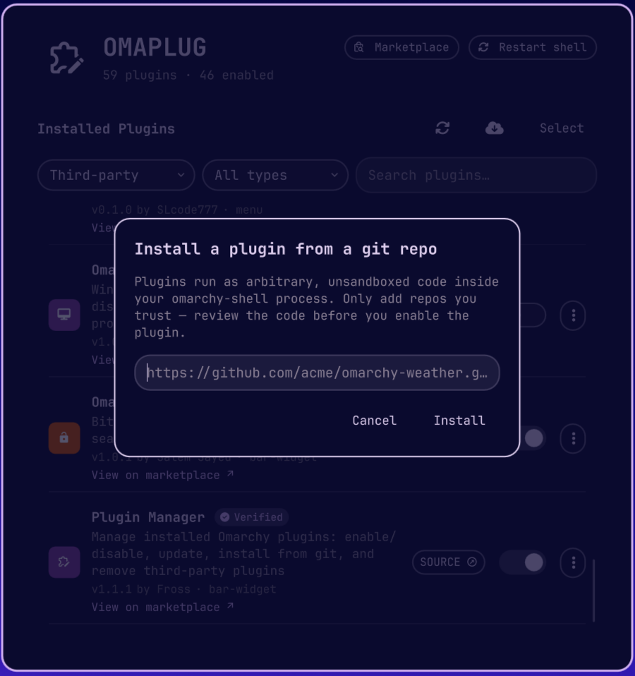
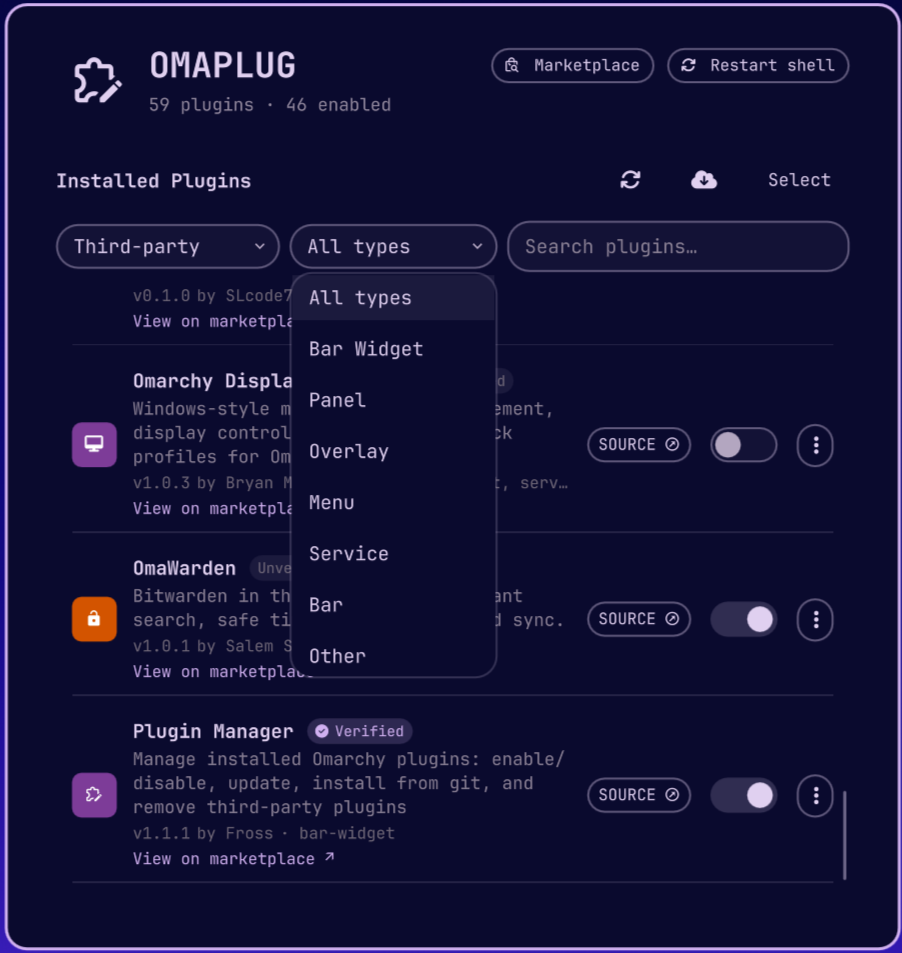
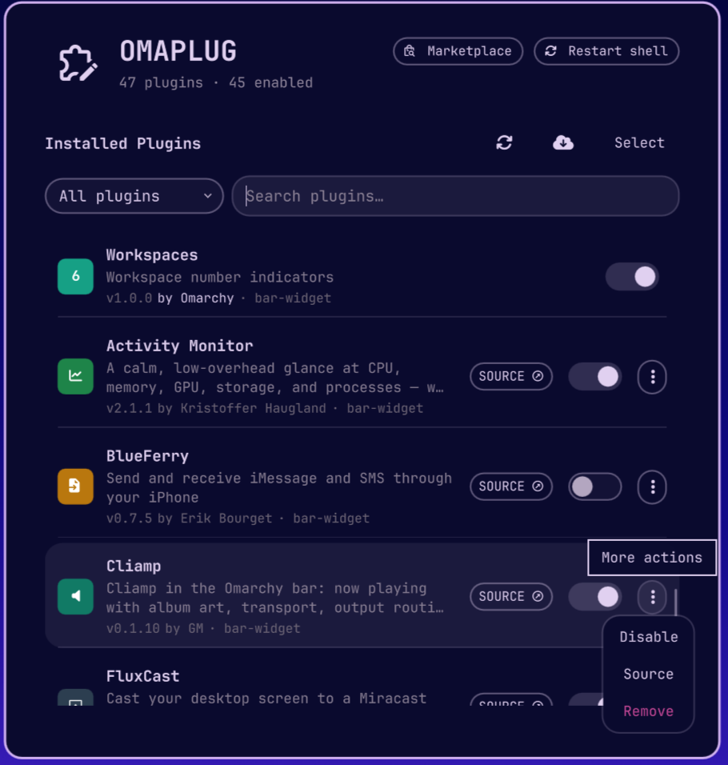

# 🧩 Omaplug

**A small tool for managing your Omarchy plugins.**

[](https://plugins.omarchy.org/plugin.html?id=omaplug) [](https://github.com/omacom/omarchy-plugin-marketplace/blob/main/SECURITY.md#automated-security-baseline)

Access it right from the Omarchy bar — it gives you a centralized place to view and organize the plugins you have installed. Here are a few things you can use it for:

- Easily turn individual plugins on or off as needed.
- Check for available updates and update them individually — or all at once.
- Remove plugins individually, or several in one go.
- Jump straight to each plugin's repo, or browse the [Omarchy marketplace](https://plugins.omarchy.org).

Omaplug is listed on the marketplace: [plugins.omarchy.org/plugin.html?id=omaplug](https://plugins.omarchy.org/plugin.html?id=omaplug)

## Screenshots


<table>
  <tr>
    <td align="center"></td>
    <td align="center"></td>
    <td align="center"></td>
  </tr>
  <tr>
    <td align="center">Plugin list</td>
    <td align="center">Checking for updates</td>
    <td align="center">Installing a plugin</td>
  </tr>
  <tr>
    <td align="center"></td>
    <td align="center"></td>
    <td align="center"></td>
  </tr>
  <tr>
    <td align="center">Scope filter</td>
    <td align="center">Type filter</td>
    <td align="center">Row action menu</td>
  </tr>
</table>

## What it can do

- **🔌 Enable / disable** — every discovered plugin (Omarchy's own and third-party) gets a simple toggle. Flipping it goes through the same registry the `omarchy plugin enable/disable` command uses, so what you see here is always what's really running.
- **🔄 Check for updates** — scans every installed third-party plugin and distinguishes clean updates from local plugins, symlinked development plugins, local changes, and genuine fetch errors.
- **⬆️ Update (or update everything)** — apply one update, or finish every proven-safe pending update from a single click, even while Omarchy reloads changed plugins.
- **➕ Install** — paste a git repo URL and add a plugin in one step. It'll warn you first that plugins run as unsandboxed code, because honesty is the default here.
- **🗑️ Remove** — third-party plugins only. Trash one, or enter Select mode to check several and remove them all at once (with a confirmation, no accidents).
- **🔗 Source link** — every git-managed plugin gets a `SOURCE` button that jumps straight to its repo page.
- **🔍 Search & filter** — narrow the list to Omarchy plugins, third-party plugins, or search by name, description, ID, author, or kind.
- **♻️ Restart shell** — if a plugin ever acts up from stale compiled code, one button clears the QML cache and restarts the shell so everything reloads fresh.

## Install

```bash
omarchy plugin add https://github.com/fross100/omaplug --enable
```

## Remove

```bash
omarchy plugin remove omaplug
```

## Remove manually

No terminal? No problem — or maybe you just like doing things the hands-on way. Here's how to remove it by hand:

1. Delete the plugin folder:

```bash
rm -rf ~/.config/omarchy/plugins/omaplug
```

2. Remove the `"id": "omaplug"` entry from the bar layout in `~/.config/omarchy/shell.json`.

3. Restart the shell to apply:

```bash
omarchy-restart-shell
```

## Requirements

- Omarchy 4.x
- Quickshell
- `git`, `jq`, and the `omarchy` CLI
- Standard coreutils (`setsid`, `nohup`, `timeout`, `sed`)

## License

[MIT](LICENSE) © 2026 Fross
